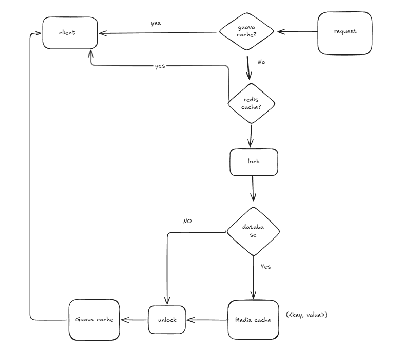
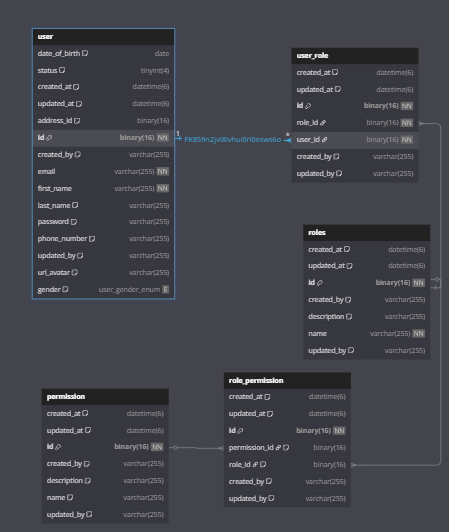
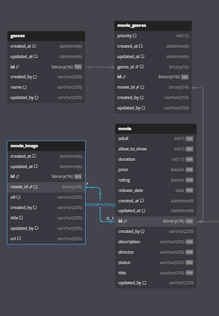
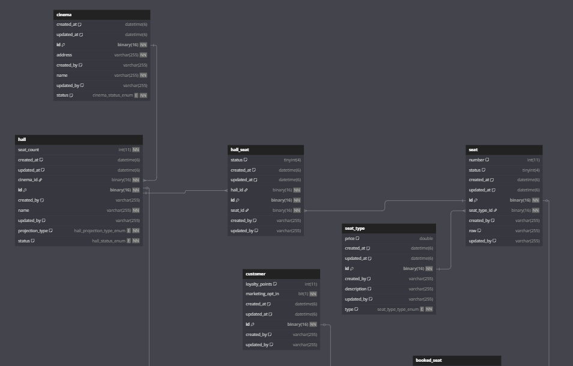
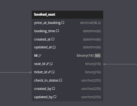
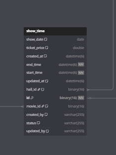
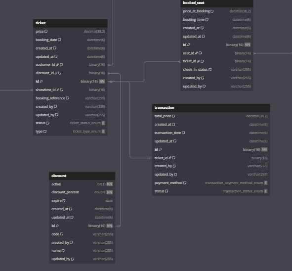

# 🎬 Cinema Management System

A robust, scalable Cinema Management System designed to efficiently handle movie scheduling, ticket bookings, seat management, and user roles. The system uses **Redis Cloud** as a centralized distributed caching layer to enhance performance and reduce database load.
The project is currently in development and continuously being updated.
Everyone is welcome to view and refer to it.
Since this is quite a large project for just 1–2 people, there may be some mistakes.
We kindly ask for constructive feedback and suggestions.
## 📌 Features

- 🎞️ Manage Movies, Showtimes, Rooms
- 🧾 Booking & Payment Processing
- 🪑 Real-Time Seat Availability
- 🧑‍💼 Role-Based Access (Admin, Staff, Customer)
- ⚡ Redis Cloud Caching for:
  - Movie and show details
  - Room availability
  - Frequently accessed static content

## 🚀 Architecture Overview

## 💡 Why Redis Cloud?

Using **Redis Cloud** provides:

- ⚡ Lightning-fast data retrieval (sub-millisecond latency)
- 🌍 Global distributed cache for scalability
- 🔄 Automatic data eviction and TTL control
- 💾 Reduced pressure on the main database
- 🔒 Highly available and secure managed service

## ⚙️ Tech Stack

| Layer             | Technology              |
|------------------|-------------------------|
| Backend          | Spring Boot (Java)      |
| Cache            | Redis Cloud             |
| Database         | MySQL                   |
| Frontend         | React                   |
| Containerization | Docker + Docker Compose |

[//]: # (| Deployment       | AWS / Azure / GCP       |)

## 🧠 Caching Flow

## Database Schema
### DB Diagram
#### User

#### Movie

#### Cinema

#### ShowTime

#### Booking

## Full database
Everyone can view full database in the follow link:
https://dbdiagram.io/d/cinemaDB-67dea22375d75cc84410463b